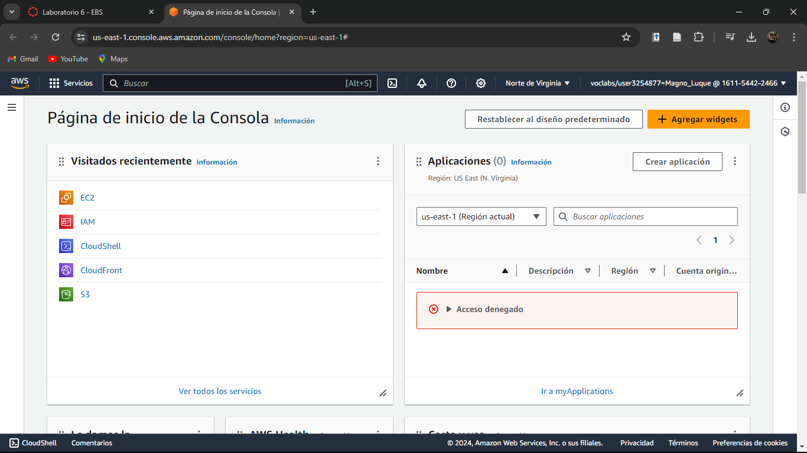

# Evidencias del desarrollo del presente laboratorio:

En este laboratorio, se creará una instancia de Amazon Elastic Compute Cloud y, a continuación, se adjuntará un volumen de Amazon Elastic Block Store.

### **Palabras clave:**
**- A:** A

---
### **Pasos:**
+ Accedemos a la consola de administración de AWS:

+ Lanzaremos una instancia EC2 como la hemos estado conociendo.

+ Ahora nos dirigimos a redes y zonas de disponibilidad de la instancia y tomaremos muy en cuenta dicha zona.

