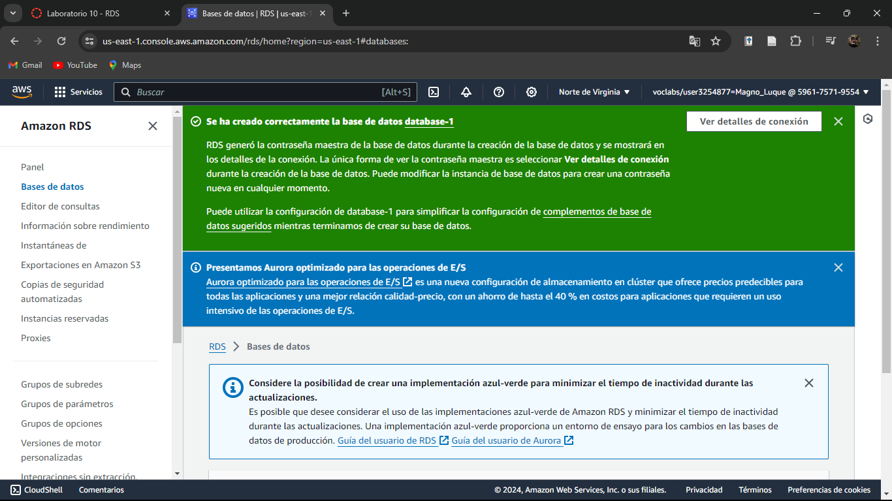
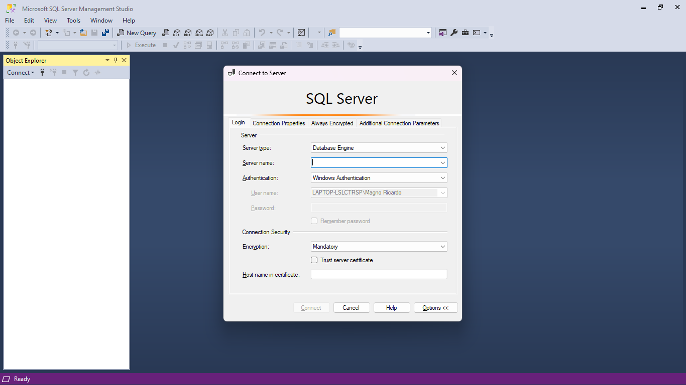
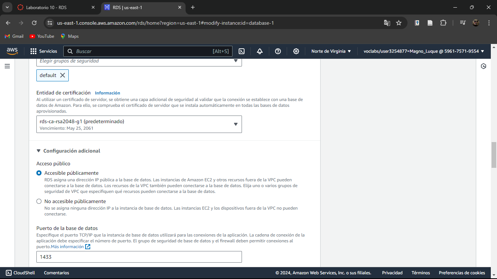
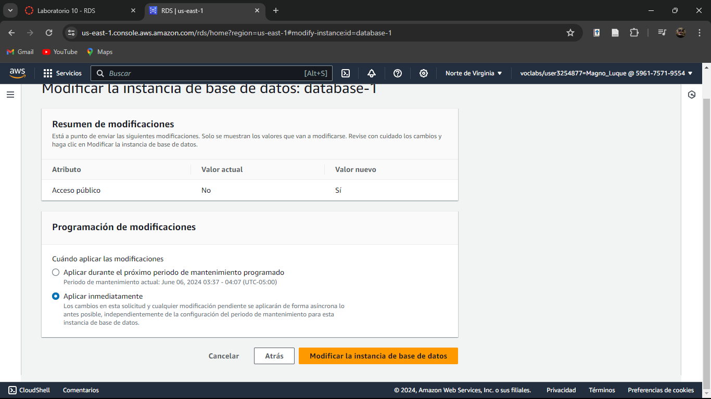
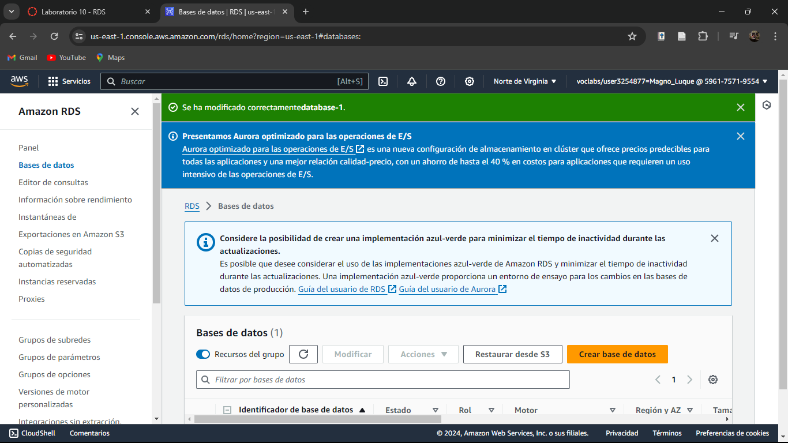
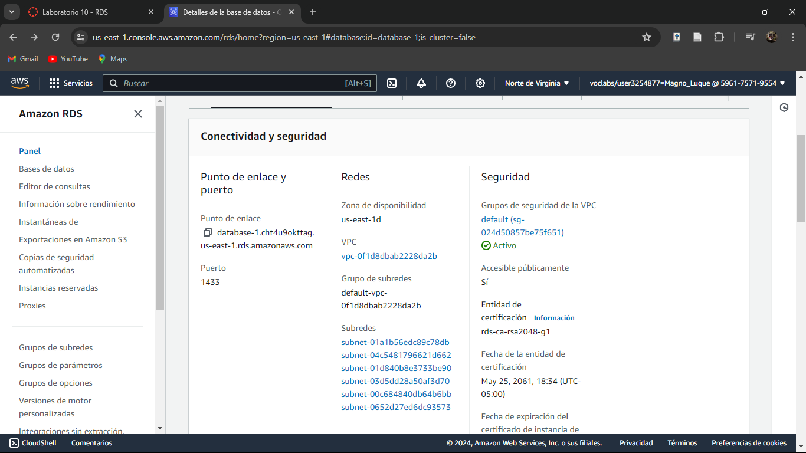
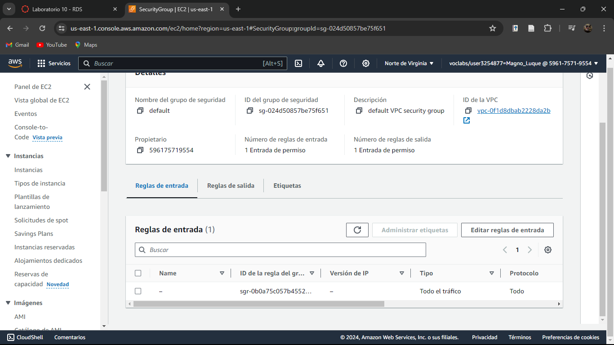
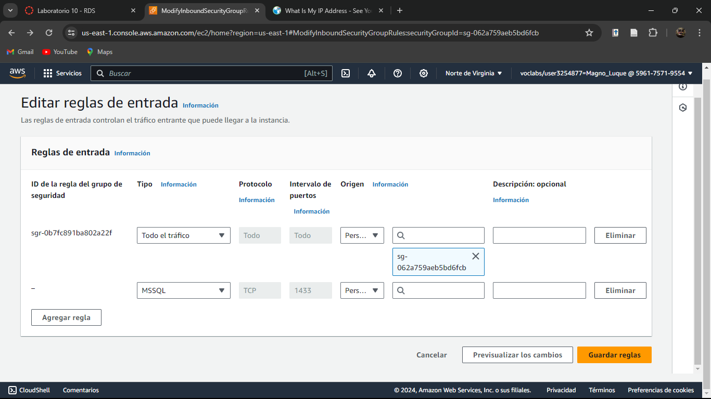
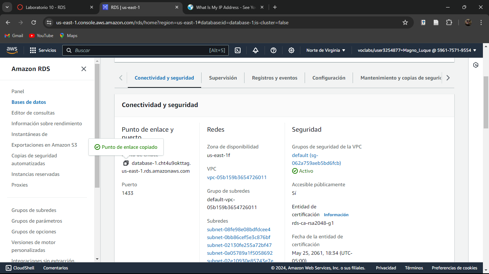
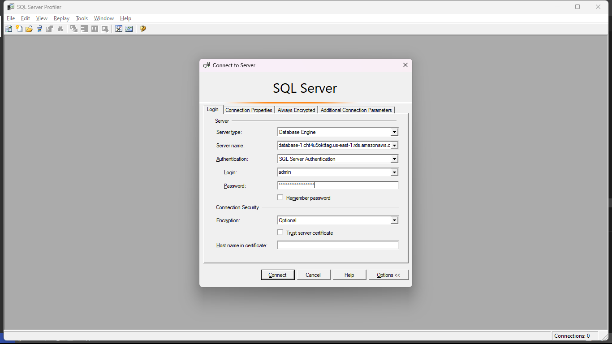

# Evidencias del desarrollo del presente laboratorio:

En este laboratorio, se creará una instancia de base de datos (DB) de Amazon Relational Database Service (Amazon RDS) que mantenga los datos utilizados por una aplicación web.

### **Palabras clave:**

**- P}:** Def

---
### **Pasos:**
+ Accedemos a la consola de administración de AWS:

+ Crearemos una base de datos con un método de creación sencilla:

+ Seleccionamos el tipo de motor:

+ Ahora el tamaño de la instancia:

+ Dejamos que las credenciales se genere automáticamente:

+ Damos click en crear base de datos:

+ Esperamos hasta que se cree completamente:

+ Podemos visualizar las credenciales de la instancia de base de datos en ver detalles de credenciales y se deberá tomar nota de esta.

+ Observamos que ya se completó la creación de nuestra instancia:

+ Ahora bien, se deberá instalar SQL Server Management Studio para conectarnos a la instancia de base de datos de RDS.

+ Haremos que la base de datos que acabamos de crear sea de acceso público:

+ En programación de modificaciones seleccionamos en aplicar inmediatamente:

+ Esperamos hasta que el estado cambie a disponible:

+ Activaremos las conexiones entrantes de SQL Server desde conexiones externas.

+ Nos dirigimos a grupos de seguridad de la VPC:

+ Ahora nos dirigimos a Reglas de entrada y en editar reglas de entrada:

+ Añadimos una nueva regla de entrada del tipo MSSQL, fuente personalizada introduciendo nuestra dirección IP/32:

+ Copiamos en un editor de texto el punto de enlace y el puerto predeterminado para SQL Server:

+ Ahora abrimos la aplicación Microsoft SQL Server Management Studio y completamos las credenciales:

+ Ahora damos click en conectar y esperamos a que se complete la conexión:

