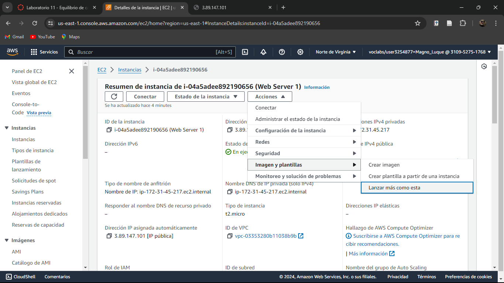

# Evidencias del desarrollo del presente laboratorio:

En este laboratorio, se creará y configurará un balanceador de carga, registrar una página web como destino del balanceador de carga y probar el balanceador de carga.

### **Palabras clave:**

**- Política:** Define qué acciones están permitidas o denegadas para recursos concretos de AWS.

---
### **Pasos:**
+ Accedemos a la consola de administración de AWS:

+ Se lanzará una instancia de Amazon EC2 como lo hemos estado haciendo pero con un paso adicional.
+ En configuraciones de red, específicamente en el botón desplegable Subred, seleccionar "Zona de disponibilidad us-east-1a":

+ Accedemos al sitio web de la instancia de EC2:

+ Se crea una segunda instancia EC2 para el balanceo de carga, lo haremos replicando la primera instancia como se muestra a continuación: 

+ Comprobamos que se lanzó correctamente las dos instancias EC2:

+ Ahora crearemos los balanceadores de carga:

+ Damos en crear balanceador de carga con el tipo de equilibrio "Balanceador de carga de aplicaciones":

+ Agregamos el nombre:

+ Ahora seleccionamos las dos zonas de disponibilidad en donde lanzamos las instancias:

+ Configuramos el grupo de seguridad:

+ Damos click en "crear grupo de destino" y agregamos el nombre del grupo de destino:

+ Completamos comprobaciones de estado:

+ Damos en siguiente y seleccionamos las instancias que acabamos de crear:

+ Incluimos como pendiente a continuación:

+ Y seleccionamos en crear grupo de destino:

+ Ahora, en el botón desplegable tomamos al grupo de destino que acabamos de crear: 

+ Nos dirigimos a la parte inferior de la página y creamos el balanceador de carga:

+ Esperamos hasta que el estado del balanceador esté activo:

+ Ahora vamos a probar el balanceador de carga.
+ Copiamos el nombre DNS en el navegador web:

Podemos notar que el mensaje que muestra cambia varias veces, esto significa que el balanceador de carga lo ha dirigido al servidor web de la otra instancia de EC2 que se creó.

### 🧑‍💻¡LABORATORIO COMPLETADO!🧑‍💻