# Evidencias del desarrollo del presente laboratorio:

En este laboratorio se creará una instancia Amazon EC2 que alojará un sitio web sencillo.

### **Palabras clave:**
**- Etiquetas:** Permite identificar los recursos del mismo tipo.

**- Imagen de máquina de Amazon (AMI):** Determina el sistema operativo (SO) que se ejecutará en la instancia. 

**- Tipo de instancia:** Define los recursos de hardware asignados a la instancia. 

**- Par clave Vockey:** Permite conectar a la instancia mediante SSH.

**- Grupo de seguridad:** Controla el tráfico de una o varias instancias asociadas a uno o varios grupos. 

**-Volumen de arranque:** Es el almacenamiento predeterminado de disco de Elastic Block Store (EBS).

---
### **Pasos:**
+ Accedemos a la consola de administración de AWS:
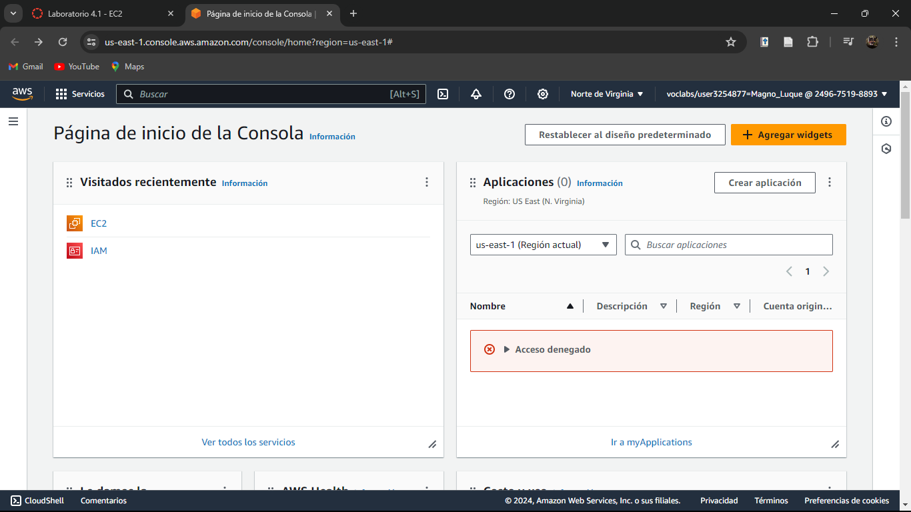

+ Seleccionamos el servicio EC2:
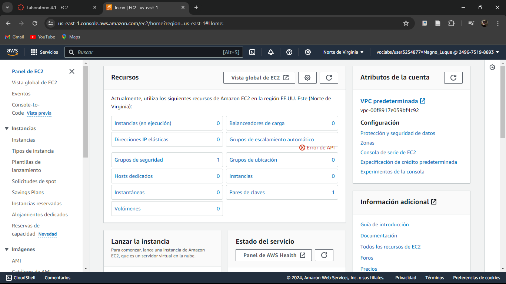

+ Preparamos la instancia:
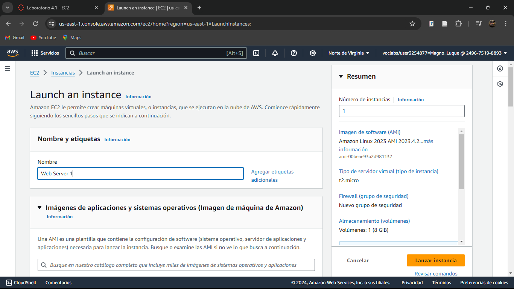
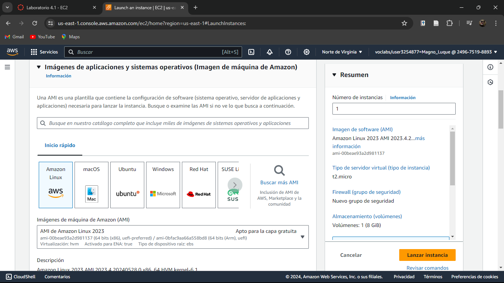
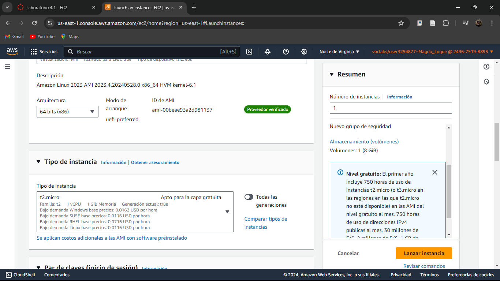
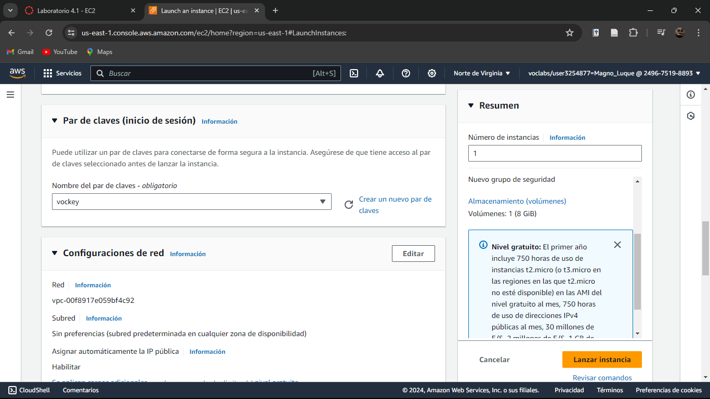
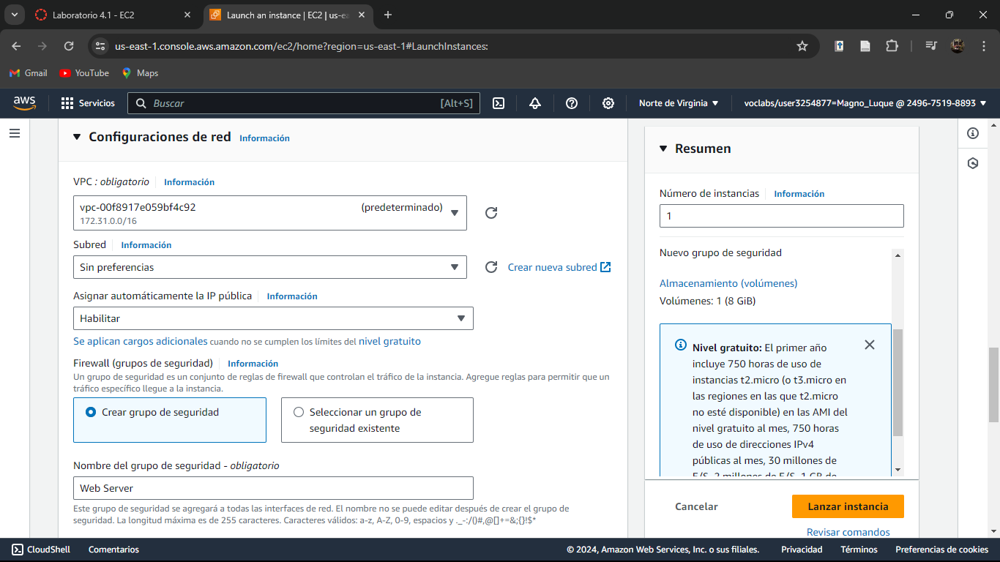
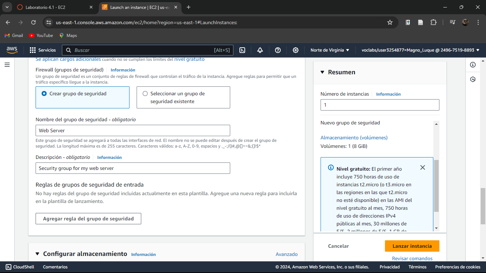
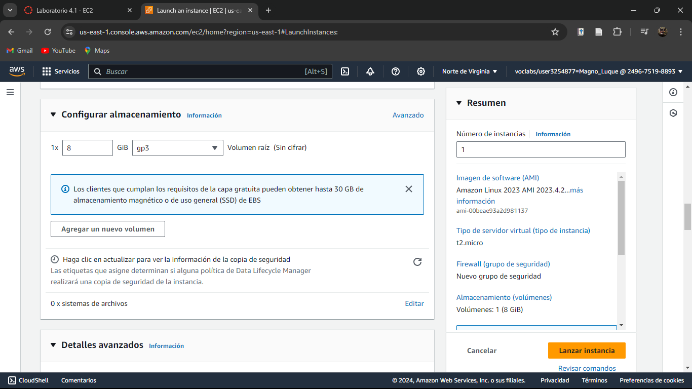
+ En detalles avanzados nos dirigimos al final y digitamos lo que se muestra en imagen: 
1. La primera línea explica que el script debe ser ejecutado usando el intérprete de Bash (Bourne Again SHell: lenguaje de secuencia de comandos orientados a la administración y automatización de tareas en sistemas operativos tipo Unix).
2. Actualiza el sistema.
3. Instala el servidor web Apache.
4. Configura el servidor web para que se inicie automáticamente en el arranque del sistema.
5. Activa el servidor web. 
6. Crea una página web de prueba. 
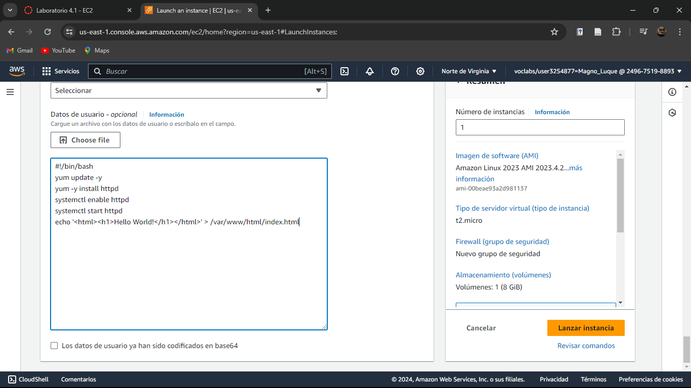

+ Lanzamos la instancia:
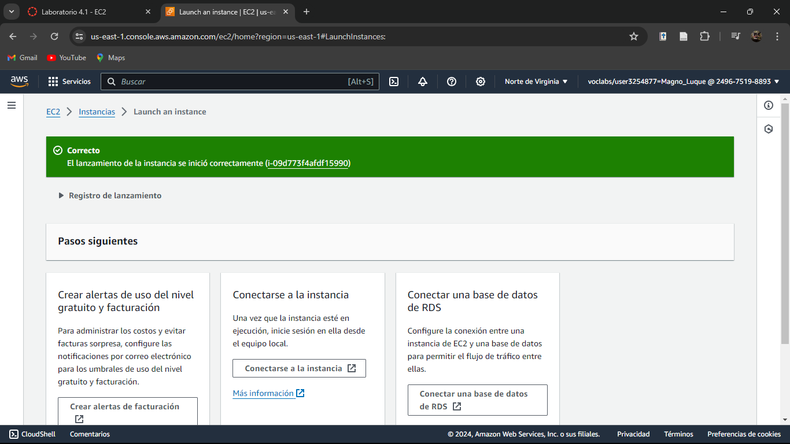
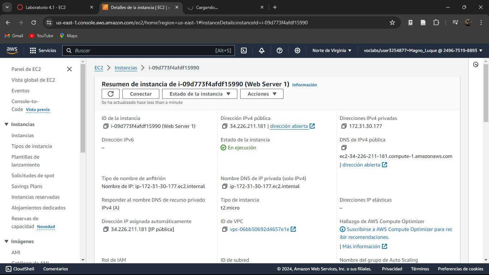
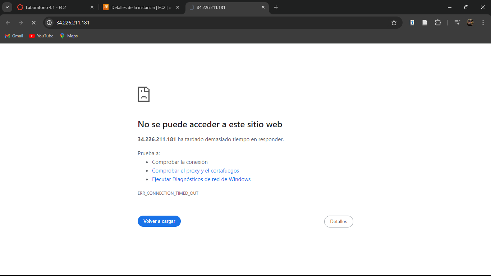

+ Configuraremos los grupos de seguridad:
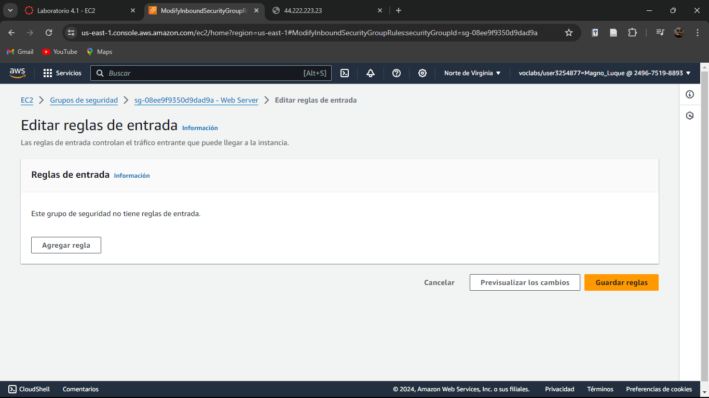
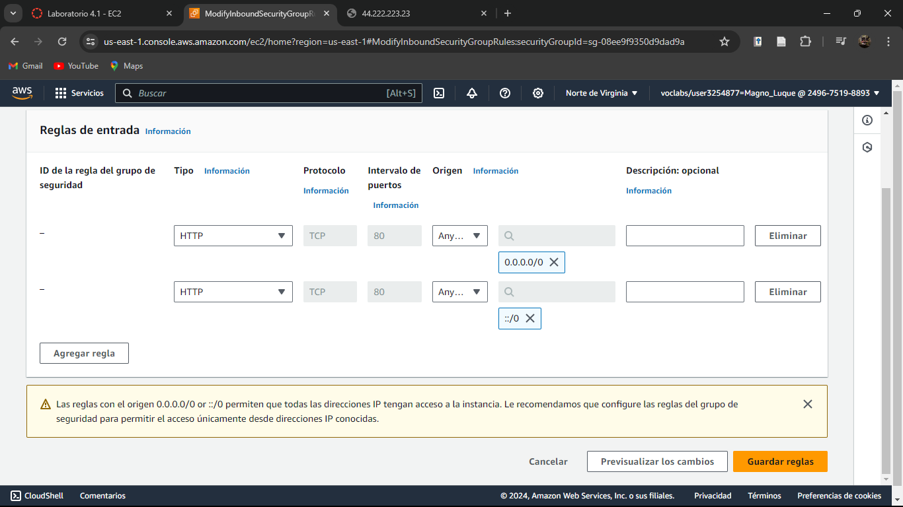
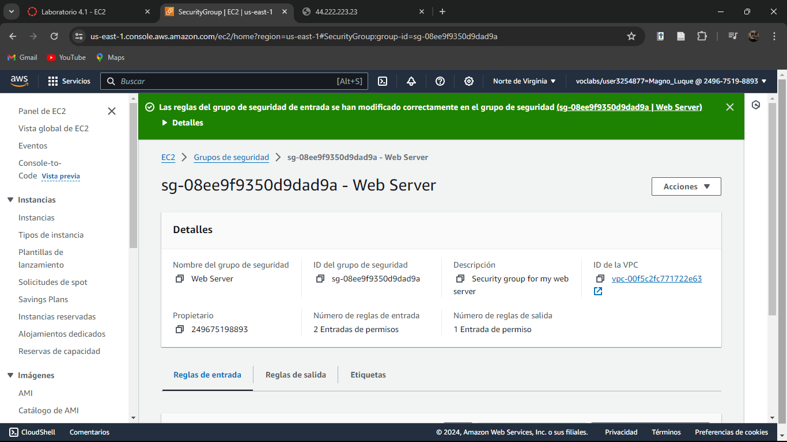
