# Evidencias del desarrollo del presente laboratorio:

En este laboratorio, se creará un bucket de Amazon Simple Storage Simple (Amazon S3) que alojará un sitio web estático.

### **Palabras clave:**
**- Access Control List (ACL):** Define qué cuentas de AWS o grupos cuentan con acceso y el tipo de acceso que tienen.

---
### **Pasos:**
+ Accedemos a la consola de administración de AWS:
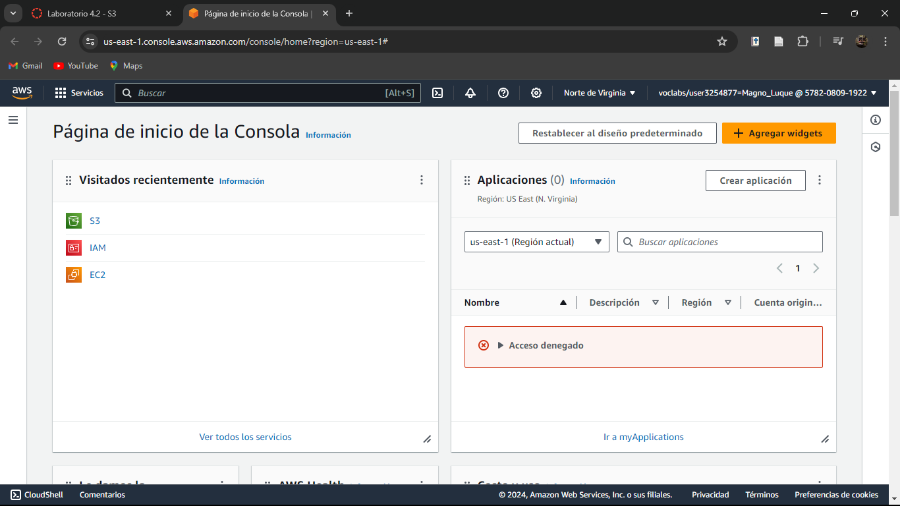

+ Seleccionamos S3 y damos a crear bucket:
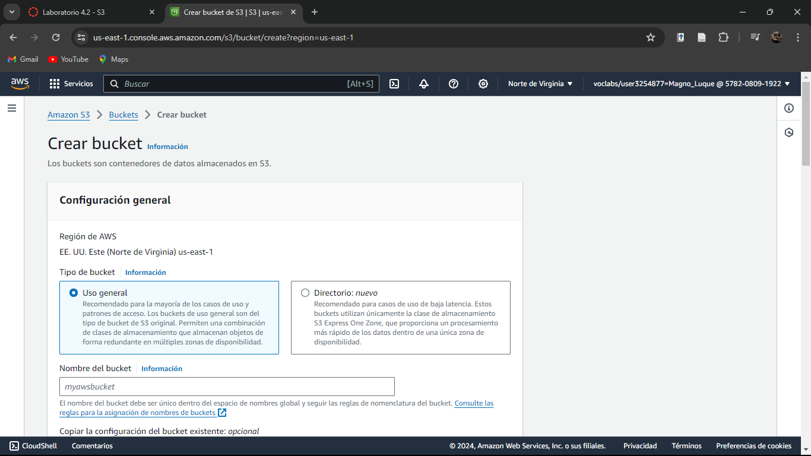
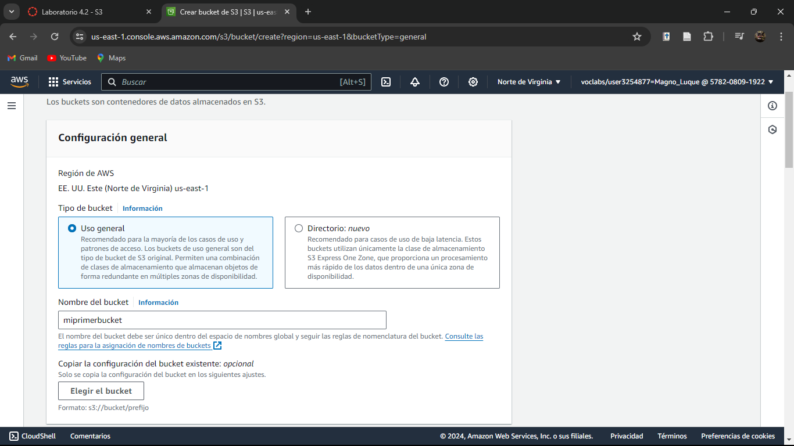

+ Configuramos el bloqueo de acceso público:

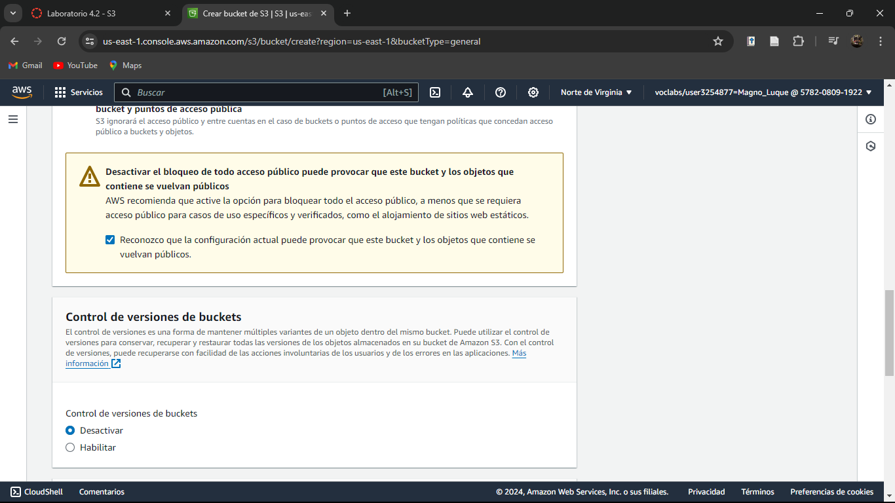

+ Damos en crear bucket:
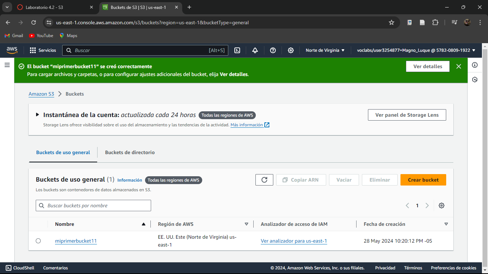

+ Añadiremos una política de bucket en permisos:
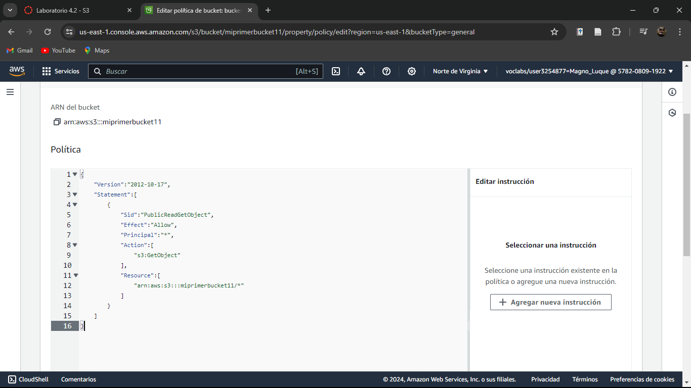

+ Cargamos un documento HTML (index):
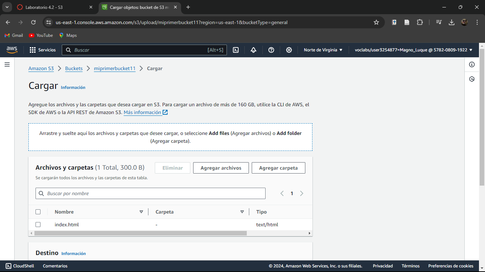

+ Definimos la clase de almacenamiento:
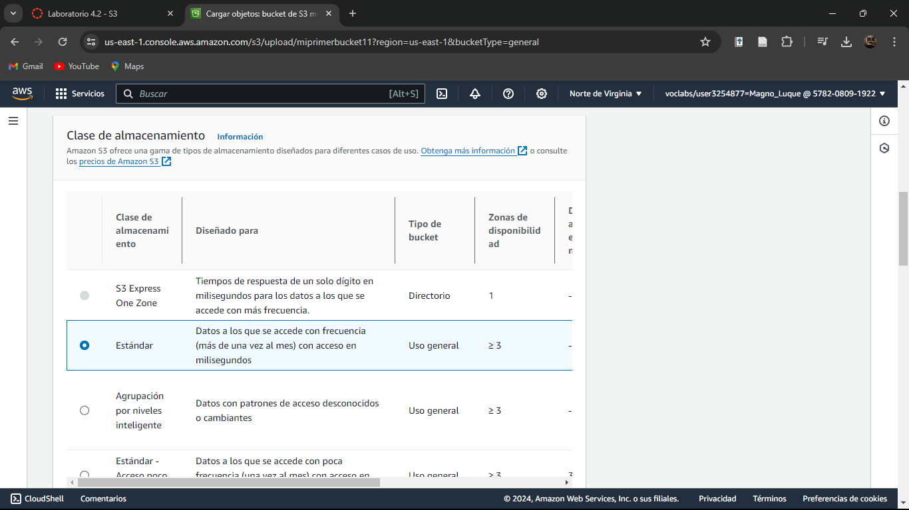
 
+ Completamos cargar el archivo:
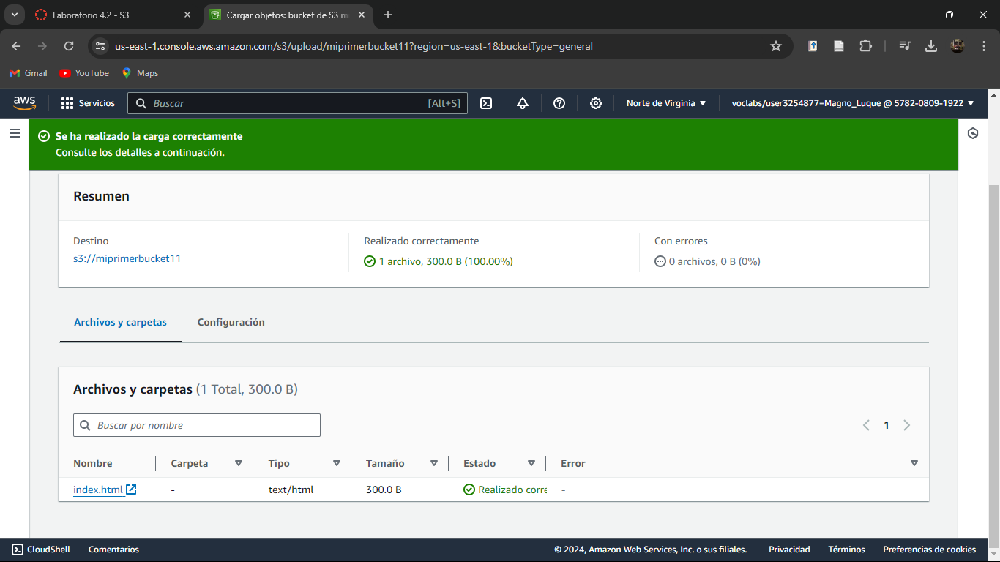

+ Nos dirigimos a alojamiento de sitios web estáticos en propiedades del objeto:
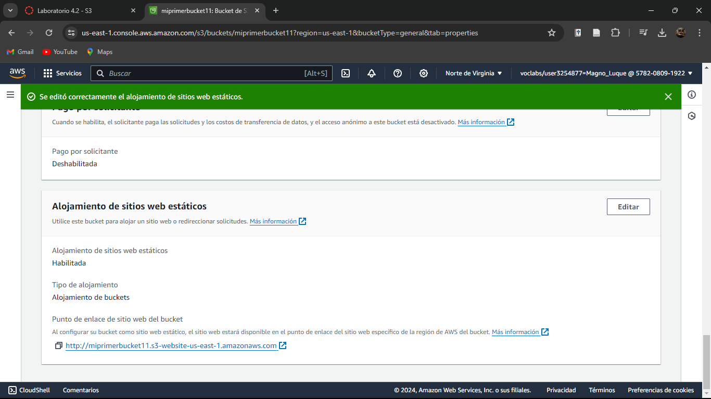

+ Comprobamos dando click en el punto de enlace de sitio web del bucket:
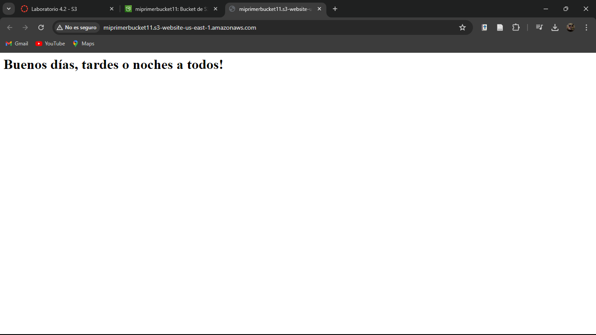

### 🧑‍💻¡LABORATORIO COMPLETADO!🧑‍💻