# Evidencias del desarrollo del presente laboratorio:

En este laboratorio, se creará una instancia de Amazon Elastic Compute Cloud y, a continuación, se adjuntará un volumen de Amazon Elastic Block Store.

### **Palabras clave:**
**- A:** A

---
### **Pasos:**
+ Accedemos a la consola de administración de AWS:
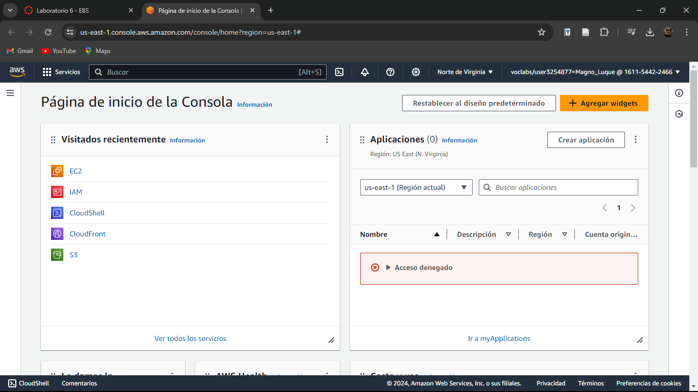

+ Lanzaremos una instancia EC2 como la hemos estado conociendo:
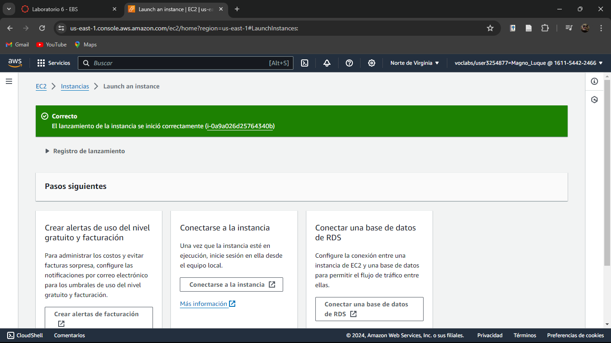

+ Lo que sigue es adjuntar un volumen de EBS a la instancia de EC2.
+ Visualizamos nuestra instancia:

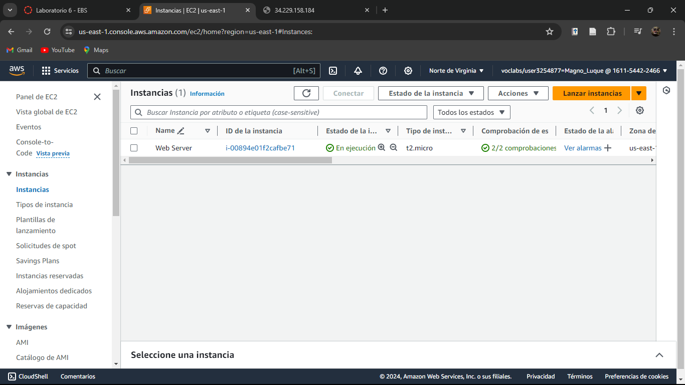

+ Ahora tomaremos nota de la zona de disponibilidad en la opción redes, esto porque el volumen de EBS debe estar en la misma zona de disponibilidad que tu instancia:

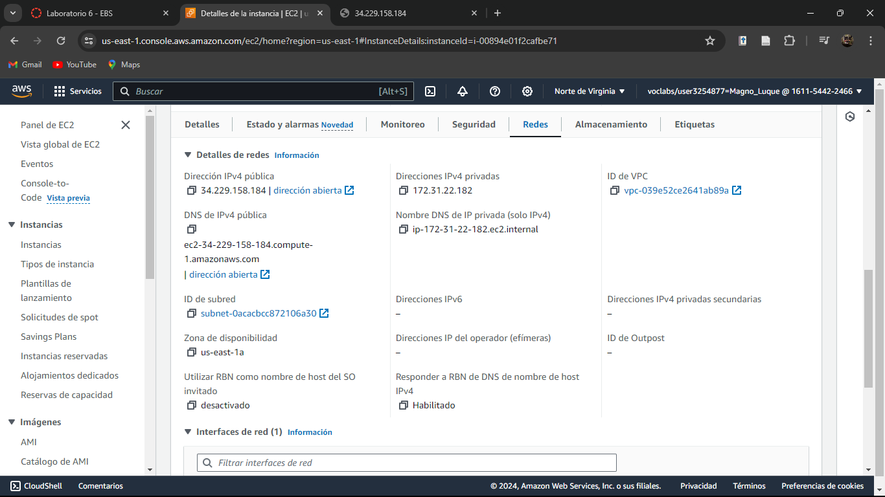

+ Ahora, en el panel izquierdo, damos click en volúmenes dentro de Elastic Block Store:

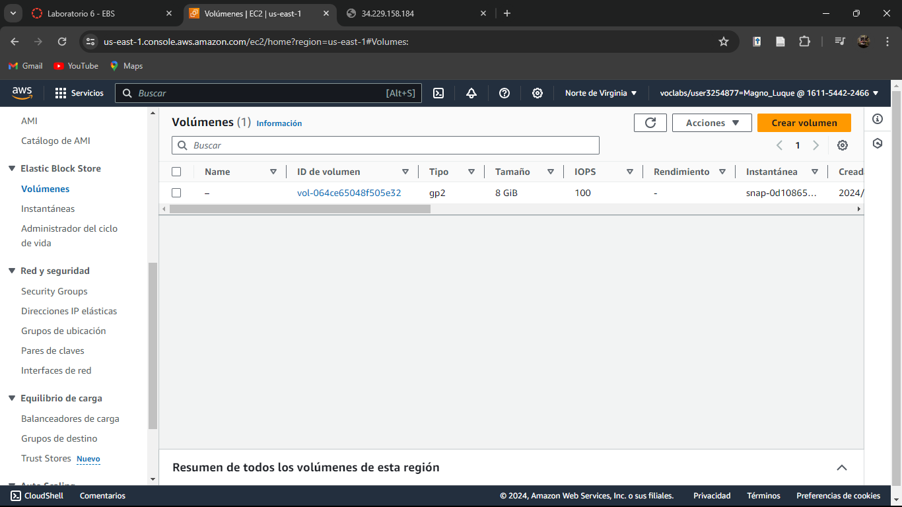

+ Damos en crear volumen:

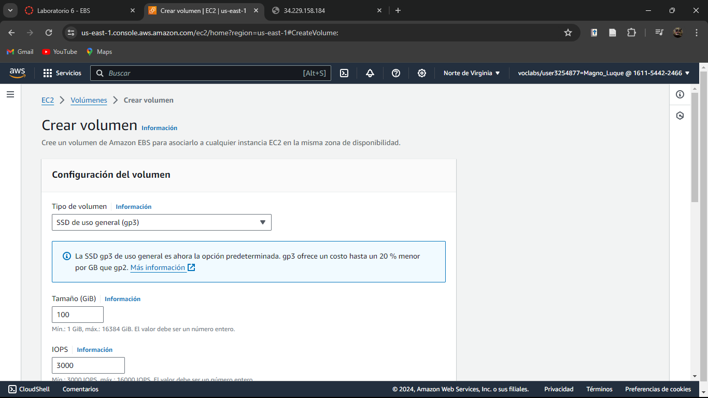

+ Crearemos un volumen de 1 GiB asegurando que se encuentra en la misma zona de disponibilidad:

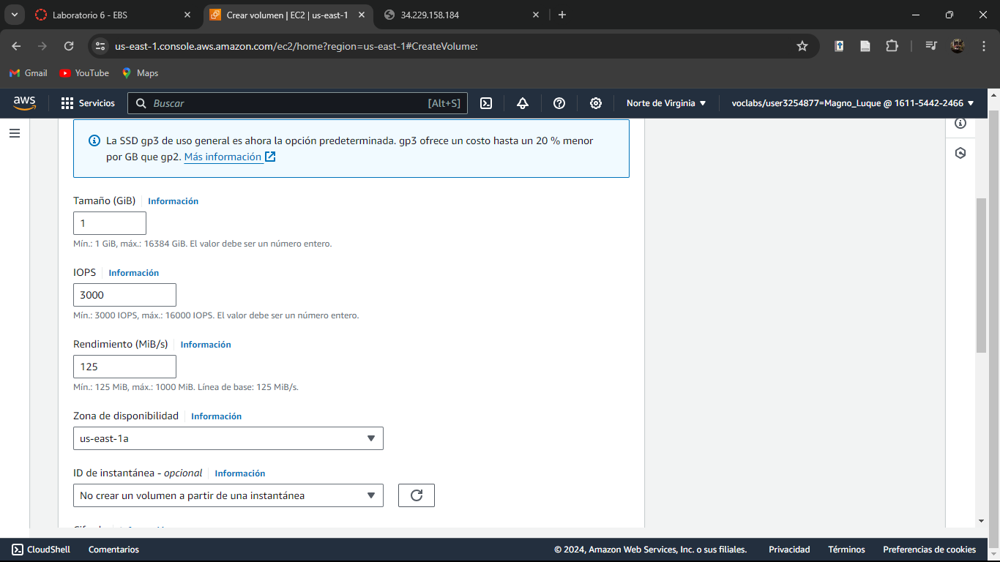

+ Presionamos crear volumen y se mostrará un mensaje de confirmación:

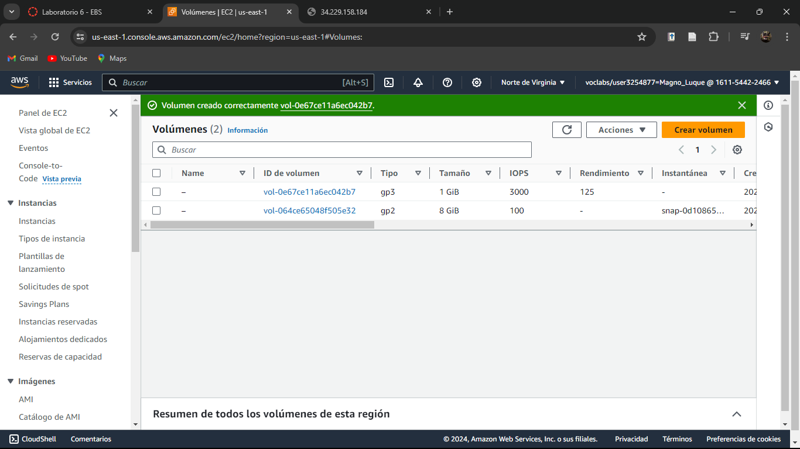

+ Hacemos click en el nuevo volumen y en acciones damos en asociar volumen: 

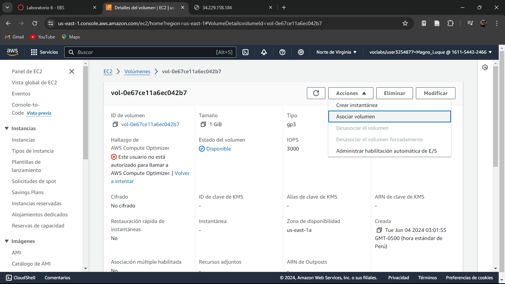

+ Seleccionamos la instancia EC2 creada inicialmente:

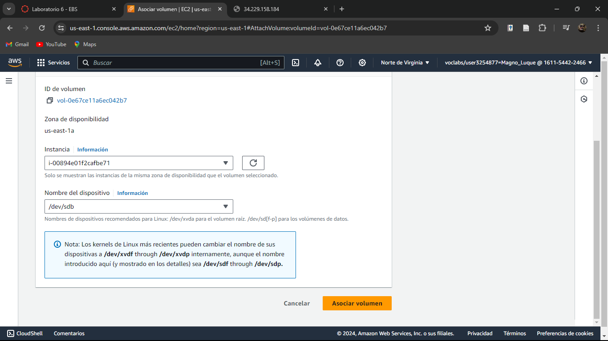

+ Damos en asociar volumen y mostrará el mensaje de proceso satisfactorio:

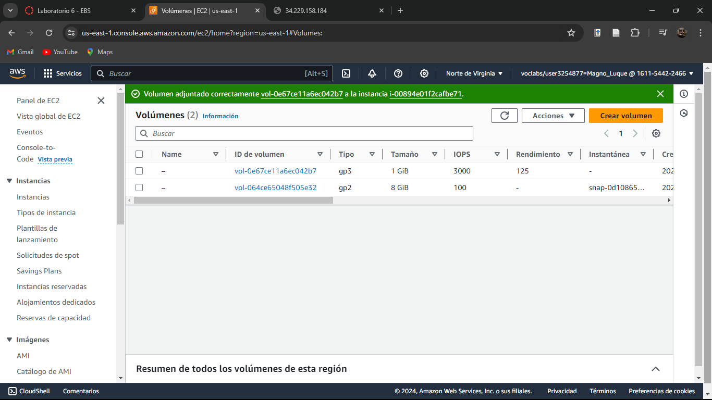

### 🧑‍💻¡LABORATORIO COMPLETADO!🧑‍💻