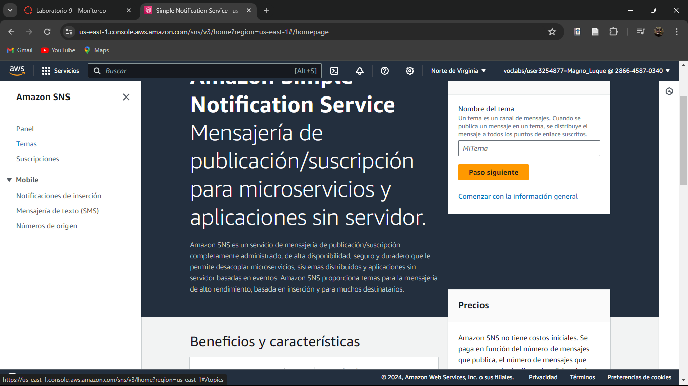

# Evidencias del desarrollo del presente laboratorio:

En este laboratorio, se creará una alarma de Amazon CloudWatch que notifica cuando la cuenta haya gastado más de una determinada cantidad de dinero. La alarma envía un mensaje a Amazon Simple Notification Service (Amazon SNS) para que envíe una notificación por correo electrónico o mensaje de texto.

### **Palabras clave:**

**- Tema:** Actúa como un canal de comunicación donde se puede publicar mensajes de alerta y eventos.

**- FIFO (first in, first out; primero en entrar, primero en salir):** Guarda analogía con las personas que esperan en una cola y son atendidas en el orden en la que llegaron.

**- Protocolo:** Se refiere al tipo de punto de enlace (correo electrónico, SMS).

---
### **Pasos:**
+ Accedemos a la consola de administración de AWS:

+ Elegimos el servicio Simple Notification Service:

+ Presionamos en temas en el panel de navegación izquierdo:

+ Damos en crear un tema:

+ Seleccionamos el tipo estandar y le introducimos un nombre:

+ Y damos en crear un tema:

+ Ahora vamos a suscribirnos para que, cuando se publique un mensaje en el tema, se envíe una notificación al teléfono o correo electrónico:

+ Elegiremos el tipo de enlace como correo electrónico:

+ Damos en crear una suscripción:

+ Confirmamos la suscripción ingresando al mensaje en la bandeja de entrada:

+ Comprobamos la suscripción:

+ Ahora, crearemos una alarma de CloudWatch seleccionandolo en el panel izquierdo de servicios:

+ Ahora damos en crear alarma:

+ Damos en seleccionar una métrica y a continuación en facturación:

+ Ahora en cargo total estimado:

+ Marcamos la casilla y seleccionar una métrica:

+ Ahora vamos a configurarlo:

+ Damos en siguientey configuramos las acciones:

+ Click en siguiente para agregar el nombre y descripción de la alarma:

+ Comprobamos las configuraciones:

+ Y damos en crear alarma:

+ Se creó correctamente la alarma:

