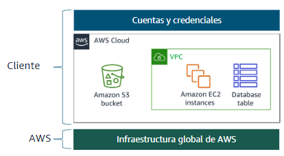
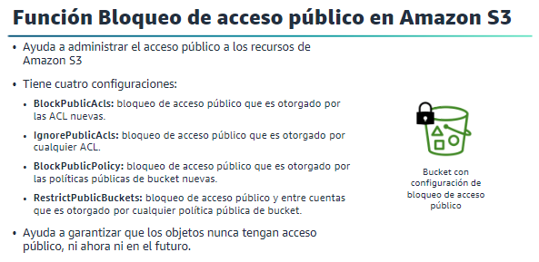
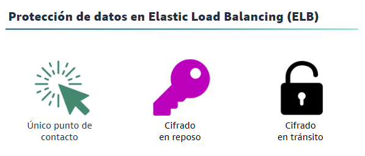

## Aquí se encontrará información importante para el buen uso del Laboratorio de AWS

### Contenido:
1. Información general sobre el Laboratorio de aprendizaje de AWS.
2. Identificar el modelo de responsabilidad compartida de AWS.
3. Identificar las prácticas recomendadas para la seguridad de AWS.
4. Identificar las prácticas recomendadas para el Laboratorio de aprendizaje de AWS Academy.

#### 1. Información general sobre el Laboratorio de aprendizaje de AWS.

El laboratorio proporciona un entorno de pruebas para explorar los servicios de AWS. El entorno presenta un conjunto restringido de servicios de AWS.

#### 2. Identificar el modelo de responsabilidad compartida de AWS.

La responsabilidad compartida se refiere a que tanto el cliente de AWS y AWS son responsables de lo siguiente:

Cliente (Responsabilidad para la seguridad **en la nube**):

+ Datos del cliente.
+ Plataforma, aplicación, IAM (Identity and Access Management).
+ Configuración de sistema Operativo, red y firewall.
+ Encriptación del lado del cliente e integridad del mismo, autenticación. 

--

Consideraciones:
+ Qué se debe almacenar
+ Qué servicios de AWS se debe usar
+ En qué región se debe almacenar los datos 
+ Qué formato de contenido y estructura usar
+ Quién debe tener acceso 

--

AWS (Responsabilidad para la seguridad **de la nube**):
1. Servicios de fundación de AWS:
    + Computación, almacenamiento, base de datos, redes
2. Infraestructura global de AWS:
    + Región, zonas de disponibilidad, ubicaciones de borde.

Ejemplo:

#### 3. Identificar las prácticas recomendadas para la seguridad de AWS.

+ **Para proteger la red:** Una de las prácticas recomendadas para proteger su red es aplicar controles tanto al tráfico entrante como al saliente. Para una VPC, esto incluye el uso de grupos de seguridad, ACL de red y subredes. Utilice subredes en varias zonas de disponibilidad para separar las capas de su aplicación. Configure grupos de seguridad y ACL de red para permitir únicamente el tráfico entrante y saliente necesario.

+ **Para proteger los recursos de cómputo:** Analizar periódicamente sus recursos de cómputo en busca de vulnerabilidades. Almacenar la clave privada en un lugar seguro, porque cualquier persona que posea dicha clave privada puede conectarse a nuestras instancias.

+ **Para proteger el almacenamiento:** 

    

#### 4. Identificar las prácticas recomendadas para el Laboratorio de aprendizaje de AWS Academy.

+ Usar las regiones permitidas.
+ Lanzar solo la cantidad de instancias necesarias.
+ Desactivar o eliminar los recursos de cómputo cuando ya no las necesite.

