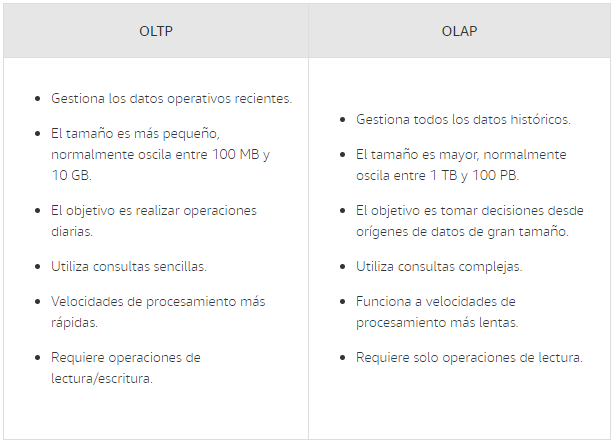

## Módulo 10: Bases de datos

**Finalidad del módulo:** 

En este módulo se obtendrá información sobre Amazon Relational Database Service (Amazon RDS), Amazon DynamoDB y el almacén de datos con Amazon Redshift. Asímismo, comparar las bases de datos relacionales y no relacionales y el procesamiento de transacciones en línea (OLTP) y el procesamiento analítico en línea (OLAP).

**Teminología tecnológica:**

**- Base de datos relacional:** Colección de conjuntos de datos organizados como registros y  columnas en tablas. En un sistema de base de datos relacional, se habla de las relaciones entre las tablas de base de datos. Por ejemplo, una base de datos de clientes haría coincidir a cada cliente con un identificador que identifica al cliente. Los desarrolladores utilizan un lenguaje de consulta estructurada (SQL). 

**- Amazon Relational Database Services (Amazon RDS):** Servicio que permite a los desarrolladores crear y administrar bases de datos relacionales en la nube.

**- Amazon DynamoDB:** Se trata del servicio de base de datos no relacional de AWS. Los datos se almacenan en pares clave-valor. 

**- Base de datos no relacional:** Denomindada también como "NoSQL". Cada entrada se almacena en un par clave-valor en el que cada vez se adjunta a valores. 

**- Amazon Redshift:** Es un servicio de almacenamiento de datos de AWS, que puede almacenar enormes cantidades de datos de manera que se pueda consultar rápidamente con fines de inteligenica empresarial (BI).

**- Procesamiento de transacciones en línea (OLTP):** Se centra en tareas orientadas a las transacciones. El OLTP consiste en insertar, actualizar o eliminar pequeñas cantidades de datos en una base de datos.

**- Procesamiento analítico en línea OLAP:** Método que permite a los usuarios extraer y consultar datos de forma eficiente y selectiva para analizarlos desde diferentes puntos de vista. 

**- Amazon Aurora:** Es el motor de base de datos relacional compatible con MySQL y PostgreSQL creado en la nube. 

**- MySQL:** Sistema de administración de base de datos relacionales de código abierto.

---
OLTP y OLAP

Existen muchos tipos diferentes de bases de datos. Para decidir cuál de ellos necesita, es importante saber cómo se van a procesar los datos. Hay dos tipos de procesamiento de datos: el procesamiento de transacciones en línea (OLTP) y el procesamiento analítico en línea (OLAP).

Las operaciones OLAP son principalmente de solo lectura; es decir, leen los datos y realizan varios tipos de procesamiento, como suma, agrupación y clasificación. Los sistemas de administración de base de datos relacional tienen funciones integradas para realizar este tipo de operaciones. Debido a que están integradas, se hacen de manera eficiente. En una base de datos no relacional, los valores se deben extraer de los pares clave-valor, lo que puede ser un proceso que requiere mucho tiempo.

Sin embargo, las operaciones del OLTP necesitan actualizar la base de datos además de leerla. La actualización puede consistir en agregar, modificar o eliminar valores. La actualización puede ser compleja porque muchas de las tablas de una base de datos relacional son virtuales. Es decir, las tablas deben combinarse en tiempo real con tablas no virtuales. Considere el siguiente ejemplo.

*La base de datos de una tienda departamental tiene tablas que contienen información sobre clientes y productos. La tabla de clientes contiene datos relacionados únicamente con los clientes, como el nombre y la dirección. La tabla de productos contiene datos relacionados únicamente con productos, como el nombre y el precio. Para registrar la información sobre las compras, se debe crear una tabla en la que la clave principal combine el ID del cliente y el ID del producto, y que muestre la cantidad de un producto determinado que compró un cliente en particular.*

*Para mostrar una lectura completa de la compra, la tabla de clientes y la tabla de productos deben combinarse en tiempo real con la tabla de compras para mostrar detalles como el nombre del cliente, el nombre del producto, la cantidad de producto comprado y el costo de la venta. El tipo de operación que combina tablas en tiempo real se denomina unión o JOIN. El resultado de JOIN es una tabla virtual y, en la mayoría de los casos, no se puede actualizar directamente.*

Por último, las consideraciones de integridad deben tratarse en una base de datos relacional. En el ejemplo, si es necesario eliminar un producto de la tabla de productos, debe haber reglas para asegurarse de que también se tratan las referencias al producto. Este tipo de reglas se conocen como reglas de integridad y consistencia.

El OLTP se realiza mejor en bases de datos no relacionales, mientras que los procesos del OLAP se realizan mejor en bases de datos relacionales.

Comparación de OLTP y OLAP

Aplicaciones del OLTP

+ Registrar pedidos en línea.
+ Procesar compras.
+ Almacenar detalles de clientes.

Aplicaciones del OLAP

+ Analizar los patrones de compra para hacer recomendaciones.
+ Hacer un seguimiento de las tendencias de compra para hacer publicidad específica.
+ Analizar las tendencias estacionales de compra para asegurarse de que los artículos estén en stock.