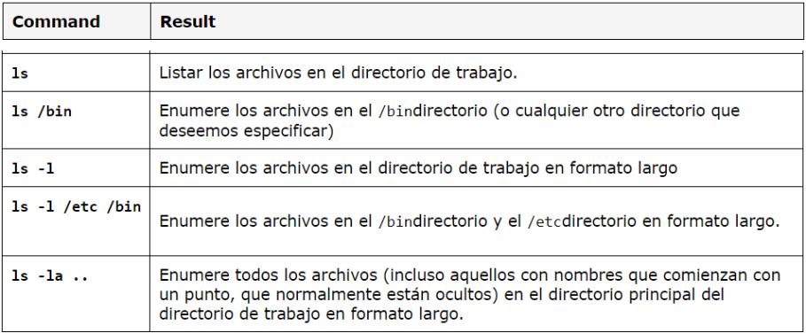
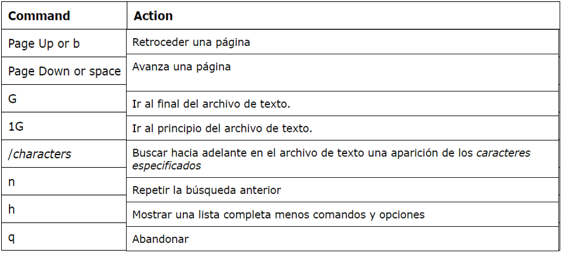
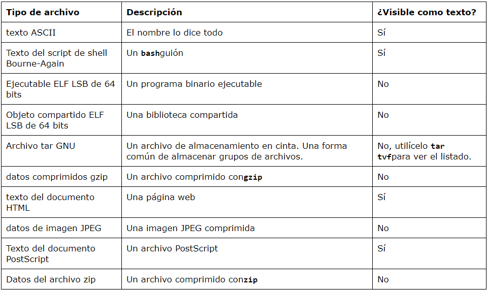

# ¿Por qué aprender linux?

---
Hoy en día, la necesidad de comprender lo que sucede con nuestro computador y lo que podemos hacer con él es importante, en línea con la actualización en temas de tecnología. Se habla de lo versátil que puede llegar a ser si lo dominamos y, de esa forma, permite trabajar en la gestión de recursos de software y hardware de una mejor manera.

---

Antes de empezar, es necesario que se tenga abierta la terminal linux. 

---

## Empecemos

Colocamos en la línea de comando cualquier texto para ver qué sucede:
```bash
richard@ml:~$ kdkjflajfks
kdkjflajfks: command not found
```
##### Notamos que dicho texto no es reconocido. 

---

Conociendo los primeros comandos ***pwd***, ***cd*** y ***ls***. 

Los nombres de ruta se pueden especificar de dos maneras; nombres de ruta absolutos o nombres de ruta relativos.

### Nombres de ruta absolutas 
Comienza con el directorio raíz y sigue el árbol rama por rama.

+ Para conocer nuestro directorio actual, usamos el comando ***pwd***:
```bash
richard@ml:~$ pwd
/home/richard
```

---

+ Para enumerar los archivos en el directorio de trabajo, usamos el comando ***ls***:
```bash
richard@ml:~$ ls
Descarga    Escritorio   Música      Público    Videos
Documentos  Imágenes     Plantillas  snap
```

---

+ Para acceder a cualquier ruta de acceso y visualizar el contenido que tiene, usamo el comando ***cd*** especificando a donde deseamos enrutarnos:
```bash
richard@ml:~$ cd /snap
richard@ml:/snap$ ls
bare   firefox   snap-store    bin    core22
```

---

### Nombres de ruta relativos
El "." es una forma alternativa para cambiar o referirse al directorio actual de trabajo y la notación ".." se refiere al directorio antecesor del directorio actual.

+ Si deseamos acceder a algún directorio agregando ".", escribimos ***cd ./snap*** en la línea de comando:
```bash
richard@ml:~$ cd ./snap
richard@ml:~/snap$ pwd
home/ricalobos/snap
```

---

+ Si deseamos retornar al directorio anterior al del actual agregando "..", escribimos ***cd ..*** en la línea de comando:
```bash
richard@ml:~/snap$ cd ..
richard@ml:~$ pwd
home/ricalobos
```

---

Ahora vamos a hacer un recorrido por nuestro sistema Linux usando algunos comandos:

* ***ls*** (lista de archivos y directorios)
* ***less*** (ver archivos de texto)
* ***file*** (clasificar el contenido de un archivo)

--- 

A continuación, se puede visualizar que el comando ***ls*** se puede usar de distinta manera: 



La mayoría de los comandos funcionan así: 
```bash
command -options arguments
```

---

Tenemos al comando ***less*** es un programa que nos permite visualizar archivos de texto.

Lo podemos llamar escribiendo:
```bash
less text_file
```

Podemos usar los siguientes comandos para así movernos por el archivo:



---

El comando ***file*** nos permite mostrar los tipos de datos que contiene un archivo y lo podemos hacer de la siguiente manera en línea de comando:

```bash
file name_of_file
```

Seguidamente nos mostrata los siguientes detalles:



---


